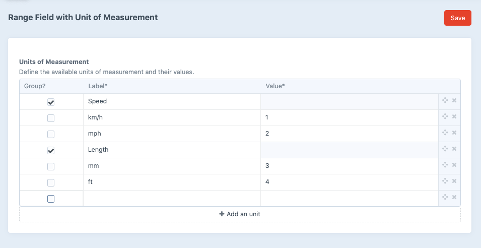
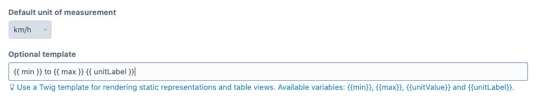
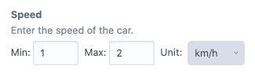

# Field with Range of Values and predefined Units of Measurement for Craft CMS


This field allows you to enter two values as range and selecting a predefined unit of measurement. Perfect to store dimensions or other ranges of values for products.

## Requirements

 * Craft CMS >= 3.0.0

## Installation

Open your terminal and go to your Craft project:

``` shell
cd /path/to/project
composer require codemonauts/craft-unit-field
./craft install/plugin unitfield
```

## Plugin Settings

In the settings you can define all available units of measurement. You can also group units to easier select them later.



## Field Settings

In every field you can set a default unit of measurement and a Twig template to render the table cells in the index of entries.



## Input

The input field has two text inputs for the minimum and maximum value and a dropdown to choose the unit of measurement.



## Usage in templates

In templates you can access the minimum and maximum values as well as the unit value and the corresponding label:

```twig
{{ entry.myField.min }} to {{ entry.myField.max }} {{ entry.myField.unitLabel }}
```

## Translation

All label can be translated. Use a translation file named `unitfield.php` in the language's translation directory. 

With ❤ by [codemonauts](https://codemonauts.com)
